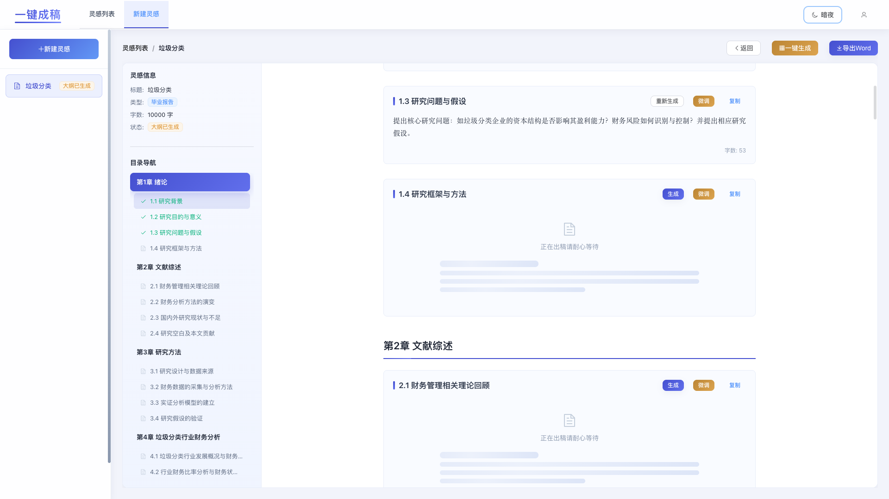
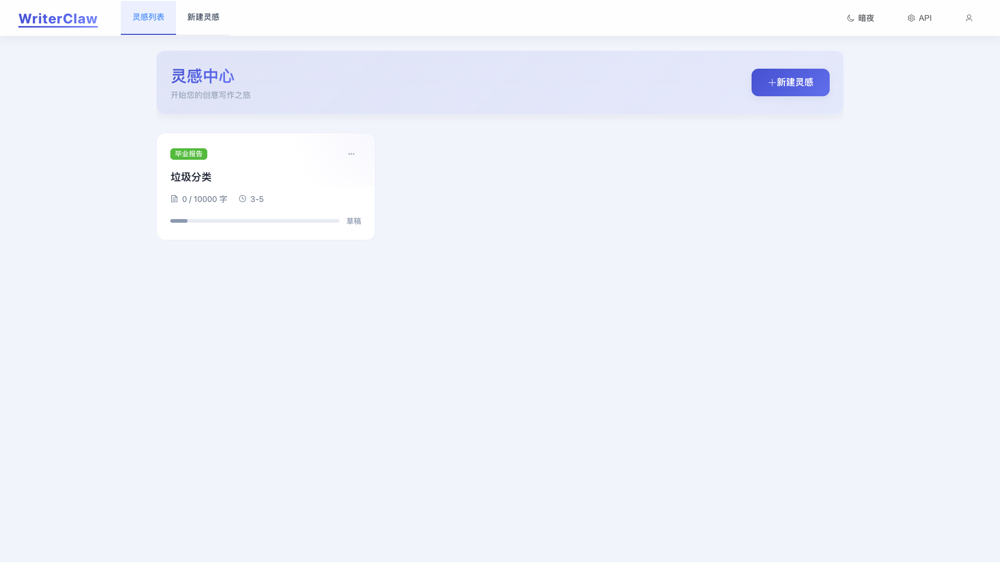
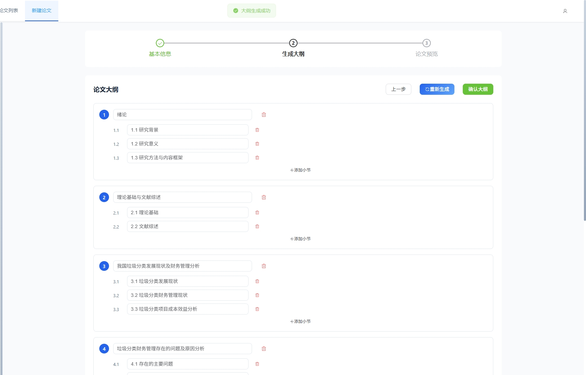

<h1 align="center" style="font-size: 48px; font-weight: bold; margin-bottom: 20px;">WriterClaw</h1>

<meta name="color-scheme" content="light dark">

  

  
  
  
  
  
  
  

  WriterClaw - AI-Powered Creative Writing Assistant

---

<h2 style="font-size: 28px; font-weight: bold; border-bottom: 2px solid #333; padding-bottom: 10px;">Table of Contents</h2>

<ul style="font-size: 16px; line-height: 2;">
  <li><a href="#1-overview">1. Overview</a></li>
  <li><a href="#2-features">2. Features</a></li>
  <li><a href="#3-tech-stack">3. Tech Stack</a></li>
  <li><a href="#4-quick-start">4. Quick Start</a></li>
  <li><a href="#5-installation">5. Installation</a></li>
  <li><a href="#6-configuration">6. Configuration</a></li>
  <li><a href="#7-docker">7. Docker</a></li>
  <li><a href="#8-project-structure">8. Project Structure</a></li>
  <li><a href="#9-api">9. API</a></li>
  <li><a href="#10-screenshots">10. Screenshots</a></li>
  <li><a href="#11-contributing">11. Contributing</a></li>
  <li><a href="#12-license">12. License</a></li>
</ul>

---

<h2 id="1-overview" style="font-size: 32px; font-weight: bold; border-left: 5px solid #409EFF; padding-left: 15px; margin-top: 40px;">1. Overview</h2>

  WriterClaw is an AI-powered creative writing assistant that helps creators and content producers efficiently generate high-quality written content. Using advanced AI technology, it can automatically generate outlines and content based on user requirements.

<h3 style="font-size: 22px; font-weight: bold; margin-top: 30px;">Core Features</h3>

<ul style="font-size: 16px; line-height: 2; color: #333;">
  <li><strong>AI-Powered Generation</strong> - Generate outlines and content using MiniMax AI</li>
  <li><strong>One-Click Generation</strong> - Quickly generate complete content</li>
  <li><strong>Outline Management</strong> - Visual editing of content structure</li>
  <li><strong>Local Storage</strong> - Data stored in local SQLite</li>
  <li><strong>Dark Mode</strong> - Support for light/dark theme switching</li>
  <li><strong>Word Export</strong> - Export to Word document with one click</li>
</ul>

---

<h2 id="2-features" style="font-size: 32px; font-weight: bold; border-left: 5px solid #67C23A; padding-left: 15px; margin-top: 40px;">2. Features</h2>

<table style="width: 100%; border-collapse: collapse; font-size: 16px; margin-top: 20px;">
  <thead>
    <tr style="background-color: #f5f7fa;">
      <th style="padding: 15px; border: 1px solid #ddd; text-align: center;">No.</th>
      <th style="padding: 15px; border: 1px solid #ddd; text-align: center;">Feature</th>
      <th style="padding: 15px; border: 1px solid #ddd; text-align: center;">Description</th>
    </tr>
  </thead>
  <tbody>
    <tr>
      <td style="padding: 15px; border: 1px solid #ddd; text-align: center;"><strong>1</strong></td>
      <td style="padding: 15px; border: 1px solid #ddd;">AI-Powered Generation</td>
      <td style="padding: 15px; border: 1px solid #ddd;">Generate outlines and content using MiniMax AI</td>
    </tr>
    <tr>
      <td style="padding: 15px; border: 1px solid #ddd; text-align: center;"><strong>2</strong></td>
      <td style="padding: 15px; border: 1px solid #ddd;">One-Click Generation</td>
      <td style="padding: 15px; border: 1px solid #ddd;">Quickly generate complete content</td>
    </tr>
    <tr>
      <td style="padding: 15px; border: 1px solid #ddd; text-align: center;"><strong>3</strong></td>
      <td style="padding: 15px; border: 1px solid #ddd;">Outline Management</td>
      <td style="padding: 15px; border: 1px solid #ddd;">Visual editing of content structure</td>
    </tr>
    <tr>
      <td style="padding: 15px; border: 1px solid #ddd; text-align: center;"><strong>4</strong></td>
      <td style="padding: 15px; border: 1px solid #ddd;">Local Storage</td>
      <td style="padding: 15px; border: 1px solid #ddd;">Data stored in local SQLite database</td>
    </tr>
    <tr>
      <td style="padding: 15px; border: 1px solid #ddd; text-align: center;"><strong>5</strong></td>
      <td style="padding: 15px; border: 1px solid #ddd;">Dark Mode</td>
      <td style="padding: 15px; border: 1px solid #ddd;">Support for light/dark theme switching</td>
    </tr>
    <tr>
      <td style="padding: 15px; border: 1px solid #ddd; text-align: center;"><strong>6</strong></td>
      <td style="padding: 15px; border: 1px solid #ddd;">Word Export</td>
      <td style="padding: 15px; border: 1px solid #ddd;">Export to Word document with one click</td>
    </tr>
  </tbody>
</table>

---

<h2 id="3-tech-stack" style="font-size: 32px; font-weight: bold; border-left: 5px solid #E6A23C; padding-left: 15px; margin-top: 40px;">3. Tech Stack</h2>

<h3 style="font-size: 22px; font-weight: bold; margin-top: 30px;">Frontend</h3>

<table style="width: 100%; border-collapse: collapse; font-size: 16px;">
  <thead>
    <tr style="background-color: #f5f7fa;">
      <th style="padding: 12px; border: 1px solid #ddd; text-align: center;">Technology</th>
      <th style="padding: 12px; border: 1px solid #ddd; text-align: center;">Description</th>
    </tr>
  </thead>
  <tbody>
    <tr>
      <td style="padding: 12px; border: 1px solid #ddd; text-align: center;"><strong>Vue 3</strong></td>
      <td style="padding: 12px; border: 1px solid #ddd;">Progressive JavaScript framework</td>
    </tr>
    <tr>
      <td style="padding: 12px; border: 1px solid #ddd; text-align: center;"><strong>Vite</strong></td>
      <td style="padding: 12px; border: 1px solid #ddd;">Next generation frontend build tool</td>
    </tr>
    <tr>
      <td style="padding: 12px; border: 1px solid #ddd; text-align: center;"><strong>Element Plus</strong></td>
      <td style="padding: 12px; border: 1px solid #ddd;">Vue 3 component library</td>
    </tr>
    <tr>
      <td style="padding: 12px; border: 1px solid #ddd; text-align: center;"><strong>Pinia</strong></td>
      <td style="padding: 12px; border: 1px solid #ddd;">Lightweight state management</td>
    </tr>
  </tbody>
</table>

<h3 style="font-size: 22px; font-weight: bold; margin-top: 30px;">Backend</h3>

<table style="width: 100%; border-collapse: collapse; font-size: 16px;">
  <thead>
    <tr style="background-color: #f5f7fa;">
      <th style="padding: 12px; border: 1px solid #ddd; text-align: center;">Technology</th>
      <th style="padding: 12px; border: 1px solid #ddd; text-align: center;">Description</th>
    </tr>
  </thead>
  <tbody>
    <tr>
      <td style="padding: 12px; border: 1px solid #ddd; text-align: center;"><strong>FastAPI</strong></td>
      <td style="padding: 12px; border: 1px solid #ddd;">Modern Python web framework</td>
    </tr>
    <tr>
      <td style="padding: 12px; border: 1px solid #ddd; text-align: center;"><strong>Python</strong></td>
      <td style="padding: 12px; border: 1px solid #ddd;">High-level programming language</td>
    </tr>
    <tr>
      <td style="padding: 12px; border: 1px solid #ddd; text-align: center;"><strong>SQLite</strong></td>
      <td style="padding: 12px; border: 1px solid #ddd;">Lightweight database</td>
    </tr>
  </tbody>
</table>

---

<h2 id="4-quick-start" style="font-size: 32px; font-weight: bold; border-left: 5px solid #F56C6C; padding-left: 15px; margin-top: 40px;">4. Quick Start</h2>

<h3 style="font-size: 20px; font-weight: bold;">Prerequisites</h3>

<ul style="font-size: 16px; line-height: 2;">
  <li><strong>Node.js</strong> >= 18.0</li>
  <li><strong>Python</strong> >= 3.9</li>
  <li><strong>MiniMax API Key</strong> - <a href="https://platform.minimaxi.com/">Get your API key</a></li>
</ul>

---

<h2 id="5-installation" style="font-size: 32px; font-weight: bold; border-left: 5px solid #409EFF; padding-left: 15px; margin-top: 40px;">5. Installation</h2>

<h3 style="font-size: 20px; font-weight: bold;">1. Clone the repository</h3>

<pre style="background-color: #f5f7fa; padding: 15px; border-radius: 5px; font-size: 14px; overflow-x: auto;"><code>git clone https://github.com/yourusername/WriterClaw.git
cd WriterClaw</code></pre>

<h3 style="font-size: 20px; font-weight: bold;">2. Backend Setup</h3>

<pre style="background-color: #f5f7fa; padding: 15px; border-radius: 5px; font-size: 14px; overflow-x: auto;"><code>cd backend

# Create virtual environment (recommended)
python -m venv venv

# Activate
source venv/bin/activate  # Linux/Mac
# venv\Scripts\activate  # Windows

# Install dependencies
pip install -r requirements.txt

# Start server
python main.py</code></pre>

<blockquote style="background-color: #f0f9ff; border-left: 4px solid #409EFF; padding: 15px; margin: 15px 0;">
  
<strong>Backend:</strong> http://localhost:8000

</blockquote>

<h3 style="font-size: 20px; font-weight: bold;">3. Frontend Setup</h3>

<pre style="background-color: #f5f7fa; padding: 15px; border-radius: 5px; font-size: 14px; overflow-x: auto;"><code>cd frontend

# Install dependencies
npm install

# Start development server
npm run dev</code></pre>

<blockquote style="background-color: #f0f9ff; border-left: 4px solid #409EFF; padding: 15px; margin: 15px 0;">
  
<strong>Frontend:</strong> http://localhost:3000

</blockquote>

---

<h2 id="6-configuration" style="font-size: 32px; font-weight: bold; border-left: 5px solid #67C23A; padding-left: 15px; margin-top: 40px;">6. Configuration</h2>

<h3 style="font-size: 20px; font-weight: bold;">Get API Key</h3>

<table style="width: 100%; border-collapse: collapse; font-size: 16px;">
  <thead>
    <tr style="background-color: #f5f7fa;">
      <th style="padding: 12px; border: 1px solid #ddd; text-align: center; width: 80px;">Step</th>
      <th style="padding: 12px; border: 1px solid #ddd;">Action</th>
    </tr>
  </thead>
  <tbody>
    <tr>
      <td style="padding: 12px; border: 1px solid #ddd; text-align: center;"><strong>1</strong></td>
      <td style="padding: 12px; border: 1px solid #ddd;">Visit <a href="https://platform.minimaxi.com/">MiniMax Platform</a></td>
    </tr>
    <tr>
      <td style="padding: 12px; border: 1px solid #ddd; text-align: center;"><strong>2</strong></td>
      <td style="padding: 12px; border: 1px solid #ddd;">Create an account and login</td>
    </tr>
    <tr>
      <td style="padding: 12px; border: 1px solid #ddd; text-align: center;"><strong>3</strong></td>
      <td style="padding: 12px; border: 1px solid #ddd;">Go to API Keys section</td>
    </tr>
    <tr>
      <td style="padding: 12px; border: 1px solid #ddd; text-align: center;"><strong>4</strong></td>
      <td style="padding: 12px; border: 1px solid #ddd;">Create a new API key</td>
    </tr>
    <tr>
      <td style="padding: 12px; border: 1px solid #ddd; text-align: center;"><strong>5</strong></td>
      <td style="padding: 12px; border: 1px solid #ddd;">Copy the API key</td>
    </tr>
  </tbody>
</table>

<h3 style="font-size: 20px; font-weight: bold; margin-top: 30px;">Configure in App</h3>

<ol style="font-size: 16px; line-height: 2;">
  <li>Open browser and visit <a href="http://localhost:3000">http://localhost:3000</a></li>
  <li>Click the <strong>API</strong> button in the top right corner</li>
  <li>Enter your MiniMax API Key</li>
  <li>Click <strong>Save</strong></li>
</ol>

---

<h2 id="7-docker" style="font-size: 32px; font-weight: bold; border-left: 5px solid #E6A23C; padding-left: 15px; margin-top: 40px;">7. Docker</h2>

<h3 style="font-size: 20px; font-weight: bold;">Using Docker Compose</h3>

<pre style="background-color: #f5f7fa; padding: 15px; border-radius: 5px; font-size: 14px; overflow-x: auto;"><code>docker-compose up -d</code></pre>

<h3 style="font-size: 20px; font-weight: bold;">Manual Build</h3>

<pre style="background-color: #f5f7fa; padding: 15px; border-radius: 5px; font-size: 14px; overflow-x: auto;"><code># Build backend image
docker build -t writerclaw-backend ./backend

# Build frontend image
docker build -t writerclaw-frontend ./frontend

# Run containers
docker run -d -p 8000:8000 writerclaw-backend
docker run -d -p 3000:3000 writerclaw-frontend</code></pre>

---

<h2 id="8-project-structure" style="font-size: 32px; font-weight: bold; border-left: 5px solid #909399; padding-left: 15px; margin-top: 40px;">8. Project Structure</h2>

<pre style="background-color: #f5f7fa; padding: 20px; border-radius: 5px; font-size: 14px; overflow-x: auto; line-height: 1.8;"><code>WriterClaw/
├── backend/              # FastAPI backend
│   ├── services/         # Business logic
│   │   ├── minimax_service.py
│   │   ├── word_service.py
│   │   └── storage.py
│   ├── main.py          # API endpoints
│   ├── requirements.txt
│   └── app_data.sqlite  # Local database
│
├── frontend/            # Vue 3 frontend
│   ├── src/
│   │   ├── views/      # Page components
│   │   ├── stores/     # State management
│   │   └── router/     # Router configuration
│   ├── package.json
│   └── vite.config.js
│
└── docs/
    └── images/         # Documentation images</code></pre>

---

<h2 id="9-api" style="font-size: 32px; font-weight: bold; border-left: 5px solid #F56C6C; padding-left: 15px; margin-top: 40px;">9. API</h2>

<table style="width: 100%; border-collapse: collapse; font-size: 16px;">
  <thead>
    <tr style="background-color: #f5f7fa;">
      <th style="padding: 12px; border: 1px solid #ddd; text-align: center;">Endpoint</th>
      <th style="padding: 12px; border: 1px solid #ddd; text-align: center;">Method</th>
      <th style="padding: 12px; border: 1px solid #ddd; text-align: center;">Description</th>
    </tr>
  </thead>
  <tbody>
    <tr>
      <td style="padding: 12px; border: 1px solid #ddd; text-align: center;">/api/papers</td>
      <td style="padding: 12px; border: 1px solid #ddd; text-align: center;">GET</td>
      <td style="padding: 12px; border: 1px solid #ddd;">List all documents</td>
    </tr>
    <tr>
      <td style="padding: 12px; border: 1px solid #ddd; text-align: center;">/api/papers</td>
      <td style="padding: 12px; border: 1px solid #ddd; text-align: center;">POST</td>
      <td style="padding: 12px; border: 1px solid #ddd;">Create new document</td>
    </tr>
    <tr>
      <td style="padding: 12px; border: 1px solid #ddd; text-align: center;">/api/papers/{id}</td>
      <td style="padding: 12px; border: 1px solid #ddd; text-align: center;">GET</td>
      <td style="padding: 12px; border: 1px solid #ddd;">Get document details</td>
    </tr>
    <tr>
      <td style="padding: 12px; border: 1px solid #ddd; text-align: center;">/api/papers/{id}/outline</td>
      <td style="padding: 12px; border: 1px solid #ddd; text-align: center;">POST</td>
      <td style="padding: 12px; border: 1px solid #ddd;">Generate outline</td>
    </tr>
    <tr>
      <td style="padding: 12px; border: 1px solid #ddd; text-align: center;">/api/papers/{id}/sections/{ch}/{sec}/generate</td>
      <td style="padding: 12px; border: 1px solid #ddd; text-align: center;">POST</td>
      <td style="padding: 12px; border: 1px solid #ddd;">Generate section content</td>
    </tr>
    <tr>
      <td style="padding: 12px; border: 1px solid #ddd; text-align: center;">/api/papers/{id}/export</td>
      <td style="padding: 12px; border: 1px solid #ddd; text-align: center;">GET</td>
      <td style="padding: 12px; border: 1px solid #ddd;">Export to Word</td>
    </tr>
  </tbody>
</table>

<blockquote style="background-color: #f0f9ff; border-left: 4px solid #409EFF; padding: 15px; margin: 15px 0;">
  
<strong>Full API docs:</strong> <a href="http://localhost:8000/docs">http://localhost:8000/docs</a>

</blockquote>

---

<h2 id="10-screenshots" style="font-size: 32px; font-weight: bold; border-left: 5px solid #409EFF; padding-left: 15px; margin-top: 40px;">10. Screenshots</h2>

<h3 style="font-size: 22px; font-weight: bold;">Document List</h3>

  

<h3 style="font-size: 22px; font-weight: bold; margin-top: 30px;">Outline</h3>

  

<h3 style="font-size: 22px; font-weight: bold; margin-top: 30px;">Document Detail</h3>

  

---

<h2 id="11-contributing" style="font-size: 32px; font-weight: bold; border-left: 5px solid #67C23A; padding-left: 15px; margin-top: 40px;">11. Contributing</h2>

  Welcome! Please feel free to submit Issues and Pull Requests.

---

<h2 id="12-license" style="font-size: 32px; font-weight: bold; border-left: 5px solid #909399; padding-left: 15px; margin-top: 40px;">12. License</h2>

  MIT License - Copyright (c) 2024 WriterClaw

---

  <strong>Made with love by WriterClaw Team</strong>

